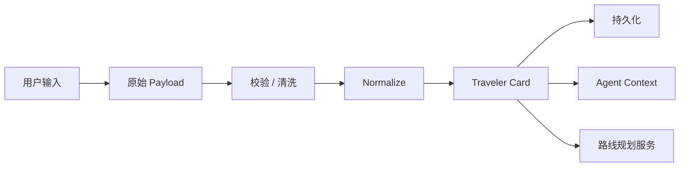

# Traveler Card 规范

用户在前端注册、偏好问卷、个人中心编辑，或通过对话补充的信息，最终会被 **规范化（normalize）** 为一张 **Traveler Card**。  
Backend、路线规划服务与 QwenPaw Agent 均通过读取 Card 来生成个性化讲解与路线，而不是直接消费原始表单字段。

> 相关文档：[`system-architecture.md`](./system-architecture.md) · [`AI伦理与政策考量_zh_cn.md`](./AI-Ethics-Policy/AI伦理与政策考量_zh_cn.md)

---

## 1. 设计原则

| 原则 | 说明 |
|------|------|
| **最小必要** | 仅 Card 中标记为 `required` 的字段阻塞核心功能；其余可选 |
| **单一事实来源** | 个性化逻辑只读 Card，不 scattered 读表单 |
| **可解释** | Card 保留 `source` 与 `derived_tags`，便于向用户说明推荐依据 |
| **可更新** | 用户可在个人中心或对话中修改；每次更新 bump `schema_version` 内的 `revision` |
| **隐私分级** | 联系信息、精确来澳时间等与推荐弱相关字段默认不参与 Agent prompt |

---

## 2. 生命周期



**输入来源（`meta.source`）**：

| source | 场景 |
|--------|------|
| `onboarding` | 首次注册 + 新手问卷 |
| `profile_edit` | 个人中心修改 |
| `chat_extraction` | 对话中补充（如「我帶老人，不要太累」） |
| `trip_wizard` | 发起路线规划前的快速确认 |

---

## 3. Card 类型

当前仅定义一种核心 Card；后续可扩展 `RouteCard`、`NarrationCard` 等，但 **用户画像始终以 Traveler Card 为准**。

| card_type | 用途 |
|-----------|------|
| `traveler` | 用户身份、语言、行程约束、兴趣与偏好 |

---

## 4. JSON Schema（`traveler` v1）

### 4.1 完整结构

```json
{
  "card_type": "traveler",
  "schema_version": "1.0.0",
  "card_id": "uuid",
  "user_id": "string",
  "revision": 1,
  "created_at": "2026-06-01T10:00:00+08:00",
  "updated_at": "2026-06-01T10:00:00+08:00",

  "identity": {
    "display_name": "string | null"
  },

  "contact": {
    "email": "string | null",
    "phone": "string | null"
  },

  "locale": {
    "language": "zh-CN",
    "region": "CN",
    "content_locale": "zh-CN"
  },

  "trip": {
    "arrival_date": "2026-06-15 | null",
    "stay_days": 2,
    "visit_purpose": "leisure"
  },

  "travel_party": {
    "type": "family",
    "size": 3,
    "includes": ["elderly", "child"]
  },

  "interests": {
    "primary": ["culture", "history"],
    "secondary": ["food", "photography"],
    "avoid": ["casino_heavy"]
  },

  "constraints": {
    "pace": "relaxed",
    "mobility": "low_stairs",
    "crowd_tolerance": "avoid_peak",
    "budget_tier": "moderate | null",
    "max_walk_km_per_day": 4
  },

  "preferences": {
    "narration_depth": "storytelling",
    "voice_enabled": true,
    "gamification_enabled": true,
    "personalization_enabled": true
  },

  "permissions": {
    "location": "while_using",
    "notifications": true
  },

  "derived": {
    "tags": ["family_friendly", "heritage_focus", "low_mobility"],
    "agent_summary_zh": "一家三代休闲游，偏好历史文化，节奏慢、少楼梯、避开人流高峰。"
  },

  "meta": {
    "source": "onboarding",
    "completeness": 0.85,
    "last_validated_at": "2026-06-01T10:00:00+08:00"
  }
}
```

### 4.2 必填与可选

| 区块 | 字段 | 必填 | 默认 | 说明 |
|------|------|------|------|------|
| 根 | `card_type` | ✅ | — | 固定 `traveler` |
| 根 | `schema_version` | ✅ | `1.0.0` | 结构版本 |
| 根 | `card_id`, `user_id` | ✅ | — | 由后端生成 |
| `locale` | `language` | ✅ | — | 界面与讲解主语言 |
| `locale` | `region` | ⬜ | `null` | ISO 3166-1 alpha-2，可选 |
| `locale` | `content_locale` | ⬜ | 同 `language` | 讲解内容语言（可与 UI 不同） |
| `identity` | `display_name` | ⬜ | `null` | 欢迎语称呼 |
| `contact` | `email` / `phone` | ⬜ | `null` | 仅账号 / 通知，**不传入 Agent** |
| `trip` | 全部 | ⬜ | `null` / 默认值 | 来澳日期、停留天数、来访目的 |
| `travel_party` | `type` | ⬜ | `solo` | 出行类型 |
| `interests` | `primary` | ⬜ | `[]` | 至少 0 项；为空时使用通用路线 |
| `constraints` | 全部 | ⬜ | 见枚举默认值 | 体力、无障碍、人流等硬约束 |
| `preferences` | 全部 | ⬜ | 见示例 | 讲解风格与功能开关 |
| `permissions` | 全部 | ⬜ | 保守默认 | 须与用户授权一致 |
| `derived` | — | — | 系统生成 | 禁止用户直接编辑 |

---

## 5. 枚举定义

### 5.1 `locale.language` / `content_locale`

| 值 | 说明 |
|----|------|
| `zh-CN` | 简体中文 |
| `zh-MO` | 繁体中文（澳门） |
| `yue` | 粤语（讲解口吻） |
| `en` | 英语 |
| `pt` | 葡萄牙语 |

### 5.2 `trip.visit_purpose`

| 值 | 说明 |
|----|------|
| `leisure` | 休闲观光 |
| `business_followup` | 商务后休闲 |
| `family_visit` | 探亲 |
| `study` | 学习 / 考察 |
| `other` | 其他 |

### 5.3 `travel_party.type`

| 值 | 说明 |
|----|------|
| `solo` | 独自 |
| `couple` | 双人 |
| `family` | 家庭 |
| `friends` | 朋友 |
| `group` | 团体 |

### 5.4 `travel_party.includes`

| 值 | 说明 |
|----|------|
| `elderly` | 含长者 |
| `child` | 含儿童 |
| `infant` | 含婴幼儿 |
| `wheelchair` | 需轮椅 / 无障碍 |

### 5.5 `interests.primary` / `secondary`

| 值 | 说明 |
|----|------|
| `culture` | 文化体验 |
| `history` | 历史建筑 |
| `food` | 美食 |
| `photography` | 摄影打卡 |
| `shopping` | 购物 |
| `entertainment` | 娱乐 |
| `nature` | 自然 / 离岛 |
| `architecture` | 建筑风貌 |
| `local_life` | 本地生活 / 市集 |
| `festival` | 节庆活动 |

### 5.6 `interests.avoid`

| 值 | 说明 |
|----|------|
| `casino_heavy` | 减少赌场综合体 |
| `long_queue` | 避免长时间排队 |
| `steep_slope` | 避免陡坡 |
| `night_only` | 避免仅夜间场景 |

### 5.7 `constraints.pace`

| 值 | 说明 |
|----|------|
| `relaxed` | 轻松，少步行 |
| `moderate` | 适中 |
| `intensive` | 特种兵 / 多点位 |

### 5.8 `constraints.mobility`

| 值 | 说明 |
|----|------|
| `standard` | 无特殊要求 |
| `low_stairs` | 少楼梯 |
| `wheelchair` | 无障碍优先 |
| `stroller_friendly` | 婴儿车友好 |

### 5.9 `constraints.crowd_tolerance`

| 值 | 说明 |
|----|------|
| `avoid_peak` | 尽量错峰 |
| `neutral` | 无特别要求 |
| `popular_ok` | 可接受热门景点 |

### 5.10 `preferences.narration_depth`

| 值 | 说明 |
|----|------|
| `brief` | 简短要点 |
| `standard` | 标准讲解 |
| `storytelling` | 故事化 / 沉浸式 |

---

## 6. 用户输入 → Card 字段映射

### 6.1 注册 /  onboarding 表单

| 用户看到的字段 | Card 路径 | 备注 |
|----------------|-----------|------|
| 姓名 | `identity.display_name` | 可选 |
| 邮箱 | `contact.email` | 可选 |
| 手机 | `contact.phone` | 可选 |
| 来自哪个国家/地区 | `locale.region` | 可选；ISO 两位码 |
| 语言偏好 | `locale.language` | **必填** |
| 讲解语言（若单独选择） | `locale.content_locale` | 默认同 UI 语言 |
| 计划来澳日期 | `trip.arrival_date` | 可选，`YYYY-MM-DD` |
| 停留几天 | `trip.stay_days` | 可选，正整数 |
| 来访目的 | `trip.visit_purpose` | 可选 |
| 旅游类型（独自/家庭/商务后…） | `travel_party.type` | 可选 |
| 同行人数 | `travel_party.size` | 可选 |
| 同行是否有老人/小孩 | `travel_party.includes` | 多选 |
| 兴趣 Checklist | `interests.primary` | 建议选 1–3 项 |
| 次要兴趣 | `interests.secondary` | 可选 |
| 不想去的类型 | `interests.avoid` | 可选 |
| 步行节奏 | `constraints.pace` | 可选 |
| 无障碍需求 | `constraints.mobility` | 可选 |
| 是否避开人流 | `constraints.crowd_tolerance` | 可选 |
| 讲解风格 | `preferences.narration_depth` | 可选 |
| 位置权限 | `permissions.location` | 与系统授权同步 |

### 6.2 对话补充 → 字段更新

Agent 或后端 NLP 可从自然语言 **patch** Card（`meta.source = chat_extraction`）：

| 用户说法示例 | 映射 |
|--------------|------|
| 「我带老人，不要太累」 | `travel_party.includes += elderly`；`constraints.pace = relaxed` |
| 「只有半天」 | 写入会话上下文 / 后续 `RouteCard`；`trip.stay_days` 不强制改 |
| 「想人少一点」 | `constraints.crowd_tolerance = avoid_peak` |
| 「多讲历史故事」 | `interests.primary` 加 `history`；`preferences.narration_depth = storytelling` |
| 「不要赌场」 | `interests.avoid += casino_heavy` |

Patch 规则：
- 对话提取的字段 **置信度低时不覆盖** 用户已在个人中心明确设置的值
- 每次 patch `revision += 1`，`updated_at` 刷新

---

## 7. Normalize 规则

Backend 在写入 Card 前执行：

1. **去空**：空字符串 → `null`；空数组保留 `[]`
2. **枚举校验**：非法值丢弃并记日志，不阻塞保存
3. **兴趣去重**：`secondary` 与 `primary` 重复项移到 `primary`
4. **推导 `derived.tags`**（示例逻辑）：

| 条件 | 追加 tag |
|------|----------|
| `includes` 含 `elderly` 或 `child` | `family_friendly` |
| `primary` 含 `history` 或 `culture` | `heritage_focus` |
| `mobility` 为 `wheelchair` / `low_stairs` | `low_mobility` |
| `crowd_tolerance = avoid_peak` | `crowd_averse` |
| `pace = relaxed` | `slow_pace` |

5. **生成 `derived.agent_summary_zh`**：1–2 句中文摘要，供 QwenPaw system context 使用；**不包含** email / phone
6. **计算 `meta.completeness`**：必填 + 推荐字段填写比例（0–1）

---

## 8. 示例

### 8.1 最小可用 Card（仅必填）

```json
{
  "card_type": "traveler",
  "schema_version": "1.0.0",
  "card_id": "550e8400-e29b-41d4-a716-446655440000",
  "user_id": "wx_openid_abc",
  "revision": 1,
  "created_at": "2026-06-01T10:00:00+08:00",
  "updated_at": "2026-06-01T10:00:00+08:00",
  "identity": { "display_name": null },
  "contact": { "email": null, "phone": null },
  "locale": {
    "language": "zh-CN",
    "region": null,
    "content_locale": "zh-CN"
  },
  "trip": {
    "arrival_date": null,
    "stay_days": null,
    "visit_purpose": null
  },
  "travel_party": { "type": "solo", "size": 1, "includes": [] },
  "interests": { "primary": [], "secondary": [], "avoid": [] },
  "constraints": {
    "pace": "moderate",
    "mobility": "standard",
    "crowd_tolerance": "neutral",
    "budget_tier": null,
    "max_walk_km_per_day": null
  },
  "preferences": {
    "narration_depth": "standard",
    "voice_enabled": true,
    "gamification_enabled": true,
    "personalization_enabled": true
  },
  "permissions": {
    "location": "denied",
    "notifications": false
  },
  "derived": {
    "tags": [],
    "agent_summary_zh": "语言：简体中文；暂无额外偏好，使用通用导览策略。"
  },
  "meta": {
    "source": "onboarding",
    "completeness": 0.2,
    "last_validated_at": "2026-06-01T10:00:00+08:00"
  }
}
```

### 8.2 完整 Card（家庭文化游）

```json
{
  "card_type": "traveler",
  "schema_version": "1.0.0",
  "card_id": "660e8400-e29b-41d4-a716-446655440001",
  "user_id": "wx_openid_xyz",
  "revision": 3,
  "created_at": "2026-06-01T09:00:00+08:00",
  "updated_at": "2026-06-01T11:30:00+08:00",
  "identity": { "display_name": "Grace" },
  "contact": { "email": "user@example.com", "phone": null },
  "locale": {
    "language": "zh-CN",
    "region": "CN",
    "content_locale": "zh-CN"
  },
  "trip": {
    "arrival_date": "2026-06-15",
    "stay_days": 2,
    "visit_purpose": "leisure"
  },
  "travel_party": {
    "type": "family",
    "size": 4,
    "includes": ["elderly", "child"]
  },
  "interests": {
    "primary": ["culture", "history"],
    "secondary": ["food"],
    "avoid": ["casino_heavy", "long_queue"]
  },
  "constraints": {
    "pace": "relaxed",
    "mobility": "low_stairs",
    "crowd_tolerance": "avoid_peak",
    "budget_tier": "moderate",
    "max_walk_km_per_day": 4
  },
  "preferences": {
    "narration_depth": "storytelling",
    "voice_enabled": true,
    "gamification_enabled": true,
    "personalization_enabled": true
  },
  "permissions": {
    "location": "while_using",
    "notifications": true
  },
  "derived": {
    "tags": [
      "family_friendly",
      "heritage_focus",
      "low_mobility",
      "crowd_averse",
      "slow_pace"
    ],
    "agent_summary_zh": "Grace 一家四口休闲游，偏好历史文化与美食，节奏轻松、少楼梯，希望避开人流高峰，减少赌场与排队景点。"
  },
  "meta": {
    "source": "profile_edit",
    "completeness": 0.92,
    "last_validated_at": "2026-06-01T11:30:00+08:00"
  }
}
```

---

## 9. API 约定（示意）

| 方法 | 路径 | 说明 |
|------|------|------|
| `POST` | `/api/v1/cards/traveler` | 首次创建（onboarding 提交） |
| `GET` | `/api/v1/cards/traveler` | 获取当前用户 Card |
| `PATCH` | `/api/v1/cards/traveler` | 部分更新（profile 或 chat patch） |
| `DELETE` | `/api/v1/users/me/data` | 账号删除时级联删除 Card |

**Agent 调用时**仅传递：

```json
{
  "traveler_card": {
    "locale": { "...": "..." },
    "trip": { "...": "..." },
    "travel_party": { "...": "..." },
    "interests": { "...": "..." },
    "constraints": { "...": "..." },
    "preferences": { "...": "..." },
    "derived": { "...": "..." }
  }
}
```

不传递 `contact`、原始 `user_id`（可用匿名 session id）。

---

## 10. 隐私与合规

- `contact` 区块 **不得** 进入 QwenPaw prompt 或前端公开展示
- 用户关闭 `preferences.personalization_enabled` 时，路线与讲解回退为 **非个性化默认策略**，Card 仍保存但不参与推荐
- 支持用户 **导出 / 删除** Card（见 AI 伦理文档用户权利）
- `derived.agent_summary_zh` 为用户可见摘要的候选文案，可在「为什么推荐这条路」中展示

---

## 11. 版本变更

| 版本 | 日期 | 变更 |
|------|------|------|
| `1.0.0` | 2026-06-01 | 初版：定义 `traveler` Card 结构与枚举 |

---

*— 实现时可在 `backend/schemas/traveler_card.json` 落地 JSON Schema 校验 —*
