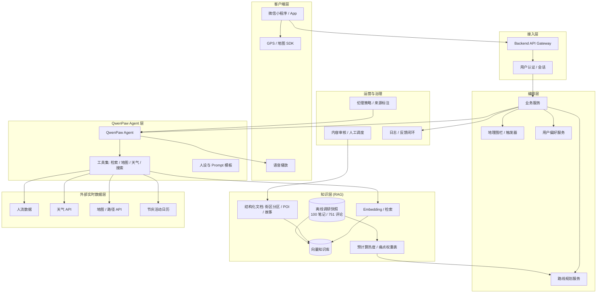
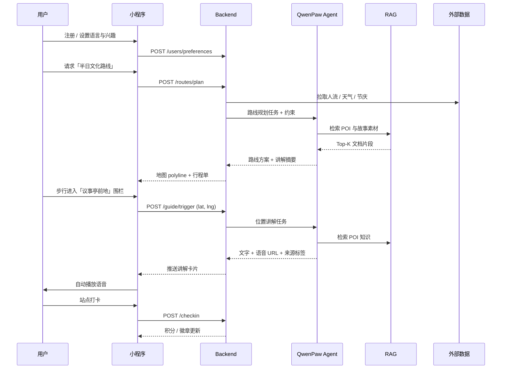

# 「千模百炼」AI 开发者系列之学生竞赛

## 参赛作品概念设计书 · 系统架构

---

| 字段 | 内容 |
|------|------|
| **项目名称** | （待定）澳门旧区 AI 智能导览 |
| **英文名称** | （待定） |
| **一句话定位** | 用 AI 为澳门旧区游客提供位置感知讲解、智能路线规划与个性化行程体验 |
| **参赛方向** | 旧区活化 / 智慧文旅 |
| **团队名称** | （待填） |
| **队长 / 队员 / 指导教师** | （待填） |
| **日期** | 2026 年 6 月 |

---

## 一、我们做什么

我们想基于 **QwenPaw** 搭建一款 **澳门旧区 AI 旅游伴侣**——以微信小程序 / 移动 App 为载体，把「走到哪里、听到哪里」的位置导览、「少排队、少暴走」的智能路线规划，以及「按人定制」的偏好服务整合在一起。

用户进入澳门历史城区后，系统根据 **实时位置** 自动推送文字与语音讲解；结合 **人流、天气、节庆、发财车路线** 与用户兴趣，动态生成并调整步行导览路线；在地图上可视化关键站点，并提供行程备忘录与打卡激励，让游览从「拍照打卡」升级为 **有故事、有节奏、可探索** 的深度体验。

简单来说：我们把 **已有的小红书调研数据**、官方资料与结构化 POI 知识，通过 **RAG 知识库 + QwenPaw Agent 编排 + 可获取的外部实时数据（人流 / 天气等）**，变成一位 **永远在线、会看地图、懂本地文化** 的 AI 导赏员。

> **数据约束（2026-06 确认）**：竞赛周期内 **不做实时社交媒体监控或持续爬取**；游客痛点、景点热度与避坑信号均来自团队 **已采集的离线数据集**（100 条高赞笔记 + 751 条评论，2023–2025），经一次性清洗后写入知识库与推荐权重表。

---

## 二、为什么做这个

### 2.1 用户痛点（调研依据）

基于小红书 **100 条高赞笔记**（10.5 万点赞）与 **751 条评论** 的分析（详见 `background/background_purpose.md`），游客面临三重困境：

| 痛点类别 | 数据信号 | 典型表现 |
|----------|----------|----------|
| **信息碎片化** | 「攻略」167 次、「怎么」61 次 | 收藏了却拼不出路线，不知道看什么 |
| **人流拥挤** | 「排队」25 次、「人多」5 次 | 大三巴等热点过度拥挤，缺少错峰建议 |
| **讲解缺失** | 「历史」22 次、「文化」11 次 | 知道有历史，却不知道去哪里了解 |
| **路线与体力** | 「路线」63 次、「累/暴走」23 次 | 走回头路、特种兵式暴走 |
| **工具空白** | 751 条评论中无人提及语音导览 App | 现有方案无法一站式解决 |

### 2.2 差异化价值

| 维度 | 现有方案 | 本项目 |
|------|----------|--------|
| 信息获取 | 碎片化攻略，手动拼凑 | 按位置推送，一站式智能导览 |
| 路线规划 | 固定路线，千篇一律 | 基于人流 / 天气 / 兴趣动态调整 |
| 文化讲解 | 人工导游（贵 / 覆盖少）或零讲解 | AI 多语言语音讲解，覆盖历史街巷 |
| 实时感知 | 无 | 人流、节庆、发财车等因子纳入决策 |
| 参与感 | 被动阅读 | 打卡 gamification，鼓励探索 |

---

## 三、系统架构（核心）

### 3.1 架构总览

系统采用 **「端—云—Agent—知识—数据」** 五层架构：前端负责交互与定位，后端负责 API 编排与业务逻辑，QwenPaw 承担 Agent 推理与工具调用，RAG 层提供可检索的澳门旧区知识（含 **离线调研快照**），外部数据层仅接入 **可合法获取的实时 API**（人流、天气、地图、节庆等）。



### 3.2 分层职责

| 层级 | 目录 | 职责 | 关键能力 |
|------|------|------|----------|
| **客户端** | `frontend/` | 用户界面、定位、地图、语音播放、打卡 UI | 微信登录、位置权限、地图 marker、TTS 播放 |
| **接入与编排** | `backend/` | REST / WebSocket API、会话管理、业务编排 | 用户注册偏好、路线 CRUD、地理围栏事件、Agent 调用封装 |
| **Agent** | QwenPaw 平台 | 对话推理、工具选择、多轮任务编排 | 讲解生成、路线解释、多语言、沉浸式叙事 |
| **知识检索** | `rag/` | 文档处理、向量化、检索增强 | POI 知识、历史故事、**离线调研 ingest**、来源分级 |
| **外部数据** | `backend/` | 拉取可授权实时 API | 人流、天气、节庆、发财车（**不含社媒**） |
| **资产与脚本** | `assets/`、`scripts/` | 演示素材、**离线数据清洗**与批处理 | 已有笔记 / 评论结构化、图表生成 |
| **治理** | `docs/` | 伦理、团队分工、竞赛材料 | AI 伦理政策、内容审核流程 |

### 3.3 核心模块设计

#### 3.3.1 旧区位置讲解模块

**触发逻辑**：客户端持续上报 coarse GPS → 后端地理围栏服务判断是否进入 POI 缓冲区 → 命中后向 Agent 发起「位置讲解」任务，携带 POI ID、用户语言与兴趣标签。

**Agent 工作流**：
1. 从 RAG 检索 POI 相关文档（历史、建筑、故事、来源类型）
2. 结合用户偏好调整讲解深度（亲子 / 文化深度 / 摄影打卡等）
3. 生成文字稿 + 调用 TTS 返回音频 URL
4. 标注内容来源（官方 / 口述 / 民间传说 / AI 整合）

**关键接口（示意）**：

```
POST /api/v1/guide/trigger     # 位置触发讲解
GET  /api/v1/poi/{id}          # POI 详情与 timeline
POST /api/v1/guide/photo       # 拍照识别后生成讲解（可选扩展）
```

#### 3.3.2 智能路线规划模块

**输入因子**（来自 README 与调研）：
- **离线调研权重**（POI 热度基线、痛点 / 避坑标签、小众候选）— 来自已有 100 笔记 / 751 评论
- 实时人流（口岸 / 景点，若 API 可接入）
- 天气条件
- 用户旅游类型与兴趣 Checklist
- 澳门节庆与文化日历
- 发财车路线（免费交通衔接）
- 步行距离 / 无障碍偏好

**规划流程**：
1. 用户提交或更新偏好（时长、兴趣、同行类型）
2. 路线服务读取 **预计算调研权重**，并拉取外部约束（人流、天气、开放状态）
3. Agent 生成候选路线 narrative + 站点顺序说明
4. 地图服务计算路径 polyline、预计时长
5. 用户可手动调整站点；系统支持行程中动态 reroute

**输出形态**：
- 地图可视化（站点 marker + 连线）
- 点击站点 → timeline 详情
- 备忘录式行程单（可离线查看）

#### 3.3.3 用户管理模块

**注册采集**（最小必要原则，详见 AI 伦理文档）：
- 必填：登录标识、语言偏好
- 可选：来澳时间、停留时长、国家 / 地区、旅游类型、兴趣 Checklist

**能力**：
- 新手教程（功能 walkthrough 视频 / 引导页）
- 个人中心：资料修改、行程历史、打卡记录
- 权限管理：位置 / 相册 / 通知的 granular 控制

#### 3.3.4 离线调研数据与人工调度

**约束**：不做实时社媒监控；社交媒体侧 **仅使用团队现有离线数据集**，在构建阶段一次性处理入库。

**现有数据资产**（详见 `background/background_purpose.md`）：

| 数据集 | 规模 | 用途 |
|--------|------|------|
| 小红书高赞笔记 | 100 条（10.5 万赞 / 11.4 万收藏） | POI 提及频次、攻略结构、热门组合 |
| 用户评论 | 751 条 | 痛点标签（排队 / 累 / 不懂历史等）、避坑表达 |
| 关键词分析结果 | 已统计词频 | 路线规划因子权重、讲解主题优先级 |

**入库流程**（`scripts/` + `rag/`，一次性 / 低频重跑）：

1. 清洗笔记与评论 → 抽取 POI、情感、痛点类别  
2. 生成 **预计算权重表**（景点热度、拥挤关联、小众推荐候选）  
3. 将典型用户表述 chunk 化写入 RAG，供 Agent 引用「游客常见困惑」  
4. 与官方 POI 文档、街区分区故事合并为统一知识库  

**Human-in-the-loop** 负责弥补 **无实时舆情** 带来的时效性缺口：

| 数据源 | 方式 | 用途 |
|--------|------|------|
| 离线调研快照 | 构建期 ingest，版本化发布 | 热度基线、避坑知识、推荐先验 |
| 口岸 / 景点人流 | CrowdPass 或同类 API（若可接入） | 路线错峰、拥挤预警 |
| 官方节庆日历 | 人工维护 + 低频同步 | 临时调整推荐权重 |
| 用户反馈 | App 内「报错 / 建议」 | 知识库纠错、Prompt 迭代（主要迭代通道） |
| 人工内容审核 | 运营后台 / 文档 PR | 新增 POI、修正错误、标记来源 |

> 路线推荐中的「热门 / 小众 / 避坑」信号 = **离线权重（静态）** + **实时人流 / 天气（动态，若可用）** + **用户偏好（会话）**。

### 3.4 数据流（典型用户旅程）



### 3.5 技术选型（建议）

| 组件 | 建议方案 | 说明 |
|------|----------|------|
| 前端 | 微信小程序（Taro / 原生） | 竞赛 Demo 优先微信生态；后续可扩展 App |
| 地图 | 腾讯 / 高德地图 SDK | 澳门 POI 与步行路径 |
| 后端 | Python FastAPI 或 Node.js | 与团队技能栈对齐；负责编排与 QwenPaw SDK 封装 |
| Agent | QwenPaw 平台 | 核心推理、工具调用、Prompt 管理 |
| RAG | 向量库（如 Milvus / pgvector）+ Embedding | 街区分区文档、POI 结构化条目 |
| 语音 | Qwen TTS 或平台内置能力 | 多语言讲解播报 |
| 任务调度 | Celery / cron（可选） | 人流 / 天气等 **外部 API** 低频刷新；**不含**社媒爬取 |
| 部署 | 阿里云（百炼代金券） | 与 QwenPaw 生态一致 |

> 以上为建议栈，可在 `docs/meeting-notes.md` 中记录最终决策。

### 3.6 仓库目录与代码边界

```
qwenpaw-ai-agent-competition/
├── frontend/          # 小程序页面、地图组件、语音播放
├── backend/           # API、Agent 封装、路线 / 用户 / 围栏服务
├── rag/               # 文档 ingest、embedding、检索实验
├── scripts/           # 离线调研数据清洗、批处理、ingest 辅助
├── assets/            # 演示图、路演素材
├── background/        # 用户调研、报告图表
└── docs/              # 架构、伦理、竞赛文档
```

### 3.7 非功能需求

| 类别 | 目标 |
|------|------|
| **延迟** | 位置触发讲解首包 < 3s（含检索 + 生成） |
| **可用性** | 核心导览功能支持弱网降级（缓存最近 POI 讲解） |
| **隐私** | 位置默认会话级使用；行程结束模糊化 / 删除轨迹 |
| **安全** | API 鉴权、图片不上传训练集、提示注入防护 |
| **可解释** | 推荐与讲解展示来源类型与不确定性 |
| **扩展** | POI 与知识文档可插件式扩充新区块 |

---

## 四、智能体交互示例

以下展示用户与系统的典型交互（含对话式补充与位置自动触发两种形态）。

**场景 A：路线规划**

> **用户**：我明天只有半天，想人少一点的旧区文化路线，带老人，不要太累。  
> **AI 导览员**：明白。我会优先推荐 **上午 9 点前的大三巴周边** 和 **路环旧区**，避开下午官也街高峰。建议路线：议事亭前地 → 玫瑰堂 → 疯堂斜巷（平缓、 shade 多）→ 午餐可在下环街市附近。预计步行约 2.5 公里，含 2 次发财车衔接。要我把这条路线保存到行程单吗？

**场景 B：位置自动讲解**

> （用户进入疯堂斜巷围栏，App 自动播放）  
> **AI 导览员**：你现在所在的 **疯堂斜巷**，名字来自末代澳督 **山度士** 在斜巷尽头建立的 **疯人院**（1874）。今天你能看到葡式黄色外墙与百年老榕树的组合——这是澳门「中西合璧」最直观的街景之一。想听「建筑故事」还是「附近 15 分钟轻松延伸路线」？

**场景 C：沉浸式叙事（可选模式）**

> **用户**：带我「走一趟」1920 年代的福隆新街。  
> **AI 导览员**：好。想象你站在街口，入夜后酒楼传出粤曲声……（第二人称沉浸式叙事，内容标注「AI 情景演绎，非史实对话」）

---

## 五、创意亮点

1. **位置感知 + 语音闭环**：从「搜攻略」变为「走到即听到」，降低信息拼凑成本。  
2. **多因子动态路线**：人流、天气、节庆、发财车、用户体力和兴趣联合优化，直击「排队」「暴走」「回头路」痛点。  
3. **RAG 来源分级**：区分官方史料、口述回忆、民间传说与 AI 补充，提升可信度。  
4. **Gamification 探索激励**：打卡与连续记录鼓励深入小巷，而非仅停留大三巴。  
5. **调研驱动的推荐先验**：将已有 100 笔记 / 751 评论沉淀为热度与痛点权重，无需实时爬取即可支撑「避坑 / 小众 / 错峰」推荐逻辑。  
6. **多语言与文化适配**：按用户语言与国家调整讲解深度，服务澳门多元访客结构。

---

## 六、计划时间表

| 时间 | 任务 | 产出 |
|------|------|------|
| **6 月上旬** | 概念设计书 / 系统架构定稿 | 本文档、竞赛提案 |
| **6 月中下旬** | 知识库 MVP：核心 POI 30+、**离线调研数据 ingest** | `rag/` + `scripts/` 清洗流水线 |
| **7 月上旬** | Backend API 骨架 + QwenPaw Agent 联调 | 讲解 / 路线最小闭环 |
| **7 月中旬** | 小程序 MVP：地图、定位、语音、行程单 | 可演示 Demo |
| **7 月下旬** | 外部数据接入（天气 / 人流 / 节庆） | 动态路线 v1 |
| **8 月上旬** | 内测 20+ 用户、收集反馈 | 问题清单与迭代 |
| **8 月中旬** | 打卡 gamification、伦理提示、内容审核 | 预赛前 polish |
| **8 月下旬** | 路演材料、实践文章 | 决赛准备 |

> 对照 `docs/competition-info.md`：概念提案 6/8–6/21，初赛 7/1–8/9。

---

## 七、预期效果与价值

### 7.1 可量化目标（初赛阶段）

- [ ] 覆盖 **≥ 30 个** 澳门旧区核心 POI 的结构化讲解  
- [ ] 提供 **≥ 5 条** 可演示的主题路线（文化 / 亲子 / 轻松 / 避 crowded / 美食）  
- [ ] 位置触发讲解准确率 **≥ 85%**（围栏命中 + 内容相关）  
- [ ] 内测用户 **≥ 80%** 认为「比静态攻略更省心」  
- [ ] 端到端 Demo：**注册 → 规划路线 → 步行触发讲解 → 打卡** 全流程可运行  

### 7.2 社会与产品价值

- **游客**：更少排队、更少暴走，更多理解旧区文化。  
- **旧区**：分流热点、提升小巷与冷门文化点曝光。  
- **团队 / 竞赛**：验证 QwenPaw Agent + RAG + 实时数据编排的可行范式。

---

## 八、AI 伦理考量

本项目已单独编写 [`docs/AI-Ethics-Policy/AI伦理与政策考量_zh_cn.md`](./AI-Ethics-Policy/AI伦理与政策考量_zh_cn.md)，架构层面落实以下控制点：

| 原则 | 架构落点 |
|------|----------|
| **尊重受访者** | 口述材料独立存储；发布前匿名化与同意记录 |
| **信息准确性** | RAG 元数据标记来源类型；动态信息（开放 / 人流）显式标注「估计值」 |
| **文化敏感度** | 敏感主题模板 + 人工审核队列；Agent system prompt 约束 |
| **透明标示** | 客户端统一 AI 生成提示；讲解卡片展示来源标签 |
| **隐私最小化** | 位置会话级；照片默认不进入训练集；用户可删除行程 |
| **人类监督** | 反馈 → 审核 → 知识库 / Prompt 更新的闭环 |

---

## 九、团队分工

| 模块 | 仓库 | 职责 | Owner |
|------|------|------|-------|
| 项目统筹 / Agent 集成 | `backend/`、`docs/` | QwenPaw 对接、API 设计、架构文档 | （待填） |
| CV / 多模态 | `backend/`、`frontend/` | 拍照识景、图像理解（可选） | （待填） |
| NLP / RAG / 数据 | `rag/`、`scripts/` | 知识库、embedding、**离线调研数据处理** | （待填） |
| 前端 / 演示 / 文档 | `frontend/`、`assets/` | 小程序 UI、地图、路演材料 | （待填） |

> 详细分工模板见 [`docs/team-roles.md`](./team-roles.md)。

---

## 附录 A：与样本文档结构对照

本文档参考「街角记忆」概念设计书体例，并针对本项目的 **全栈实现** 扩展了 **第三章系统架构**：

| 样本章节 | 本文档章节 |
|----------|------------|
| 一、我们想做什麼 | 一、我们做什么 |
| 二、為什麼做這個 | 二、为什么做这个 |
| 三、怎麼做（技術方案） | **三、系统架构（核心）** ← 扩展 |
| 四、智能體對話示例 | 四、智能体交互示例 |
| 五、創意亮點 | 五、创意亮点 |
| 六、計劃時間表 | 六、计划时间表 |
| 七、預期效果與價值 | 七、预期效果与价值 |
| 八、AI 倫理考量 | 八、AI 伦理考量 |
| 九、團隊分工 | 九、团队分工 |

---

*— 文档版本 v0.1 | 随实现迭代更新 —*
